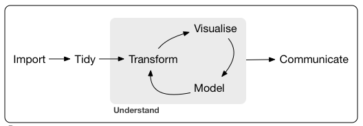
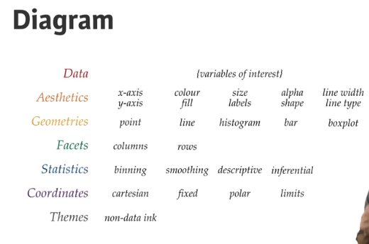

# Tidyverse in the Batcave

The tidyverse is a coherent system of packages for data manipulation, exploration and visualization that share a common design philosophy. Fundamentally, the tidyverse is about the connections between the tools that make the workflow possible.

```{r}
install.packages("tidyverse") #How to install the tidyverse package
library("tidyverse")
```
## Core tidyverse consists of
1. **ggplot2 - plotting library**
2. **dplyr - data manipulation**
3. **tidyr - data cleaning**
4. readr - data ingest
5. purrr - tools for functions and vectors
6. tibble - reimagined data.frames
7. stringr - string manipulation
8. forcats - factors


# 0. Data cleaning with TIDYR
A tidy dataset is where each variable is saved in its own column and each observation is saved in its each row.

Reshaping a dataset is basically changing the layout of a data set. There are four verbs for that.
```{r}
gather()
separate()
spread()
unite()
```

# 1. Data wrangling with DPLYR
#F-SAMS-GB-DSSTCUTMe
Data wrangling primarily consists of Selecting, Filtering, Arranging, Mutating, Summarizing and Grouping.

```{r}
install.packages("gapminder")
install.packages("dplyr")
library(gapminder)
library(dplyr)
summary(gapminder$continent)
```

### Filtering
Look for a subset based on a certain condition. The old way of doing this is to use the *subset* base R command. The new way is to use *filter* and the pipes command. Multiple conditions are separated by a comma.
```{r}
#old way
Afghan1 <- subset(gapminder, country=="Afghanistan")
#Dplyr filter way
Afghan2 <- gapminder %>% filter(country == "Afghanistan")
#Dplyr multiple variables
Afghan2007 <- gapminder %>% filter(country =="Afghanistan", year==2007)
Afghan1 == Afghan2 #True
Afghan2007
SpecificCountries <- gapminder %>% filter(country %in% c("Afghanistan, Russia, China"))
```

### Arranging
Sort your dataset with arrange. The old way of doing this is to use the *sort* base R command. The new way is to use *arrange*.
```{r}
#old way
sort(gapminder$gdpPercap, decreasing = FALSE) #ascending order

#Dplyr arrange way
gapminder %>%
  arrange(gdpPercap) #ascending

gapminder %>%
  arrange(desc(gdpPercap)) #descending


#Combine filter and arrange
BestGDP2007 <- gapminder %>%
                    filter(year == 2007) %>%
                      arrange(desc(gdpPercap))
BestGDP2007
```

### Mutating
Mutating modifies or adds to existing columns.
```{r}
#modify a variable
gapminder %>%
  mutate(pop = pop/100000) #mutate(whatsbeingreplaced = whatsbeingcalculated)

#add a column
gapminder %>%
  mutate(gdp = gdpPercap*pop)
```

### Summarizing and grouping

The data transformation and visualization process:


```{r}
#return the mean of all life expectancies as one value
gapminder %>%
  summarize(meanLifeExp = mean(lifeExp))

#return a filtered list of two summarized values
gapminder %>% filter(year == 1957) %>% summarize(medianLifeExp = median(lifeExp), maxGdpPercap = max(gdpPercap))

#return a grouped list
gapminder %>% group_by(year) %>% summarize(meanLifeExp = mean(lifeExp), totalPop = sum(pop))

#group by year and continent
gapminder %>%
    group_by(year, continent) %>%
      summarize(meanLifeExp = mean(lifeExp), totalPop = sum(pop))

# Summarize medianGdpPercap within each continent within each year: by_year_continent
by_year_continent <- gapminder %>%
  group_by(continent,year) %>%
    summarize(medianGdpPercap = median(gdpPercap))

# Plot the change in medianGdpPercap in each continent over time add a zero start y axis
ggplot(by_year_continent, aes(x=year, y=medianGdpPercap, color=continent))+geom_point()+expand_limits(y=0)
```

---

# 3. Data visualisation with GGPLOT2

Visualising data is done with ggplot2.

```{r}
library(ggplot2)
gapminder_1952 <- gapminder %>% filter(year == 1952)

#old way of plotting
plot(gapminder_1952$gdpPercap,gapminder_1952$lifeExp)

#Using the three base layers - data, aesthetics and geometries
ggplot(gapminder_1952, aes(x = gdpPercap, y = lifeExp)) +
  geom_point()

#apply a log transformation and color
ggplot(gapminder_1952, aes(x = gdpPercap, y = lifeExp, color=continent, size=pop)) +
  geom_point()+scale_x_log10()

#adding a facet
ggplot(gapminder_1952, aes(x = gdpPercap, y = lifeExp, color=continent, size=pop)) + geom_point()+scale_x_log10()+facet_wrap(~ continent)

```

### Popular types of data visualisation

```{r}
# Line plots
ggplot(gapminder_2007, aes(x=year, y=lifeExp))+geom_line()

# Bar plots
ggplot(gapminder_2007, aes(x=year, y=lifeExp))+geom_col()

# Histograms - have one aesthetic
ggplot(gapminder_2007, aes(x=lifeExp))+geom_histogram(binwidth = 5)

# Boxplots
ggplot(gapminder_2007, aes(x=year, y=lifeExp))+geom_boxplot()


```

# 3. Cleaning and joining data with Tidyr


